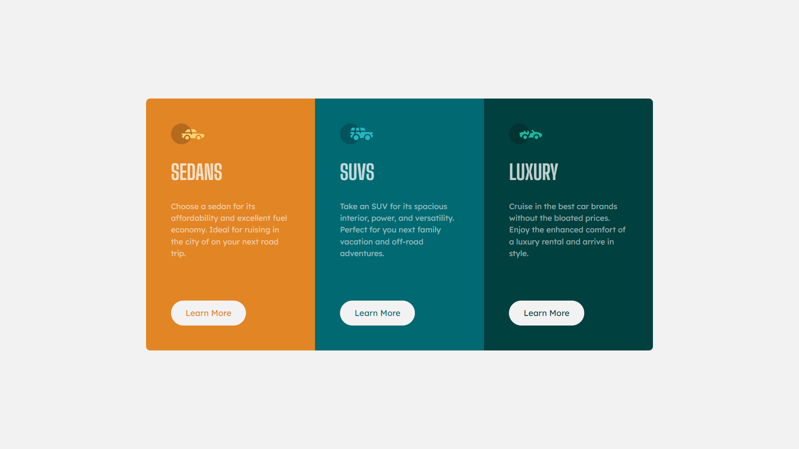

# Frontend Mentor - 3-column preview card component solution

This is a solution to the [3-column preview card component challenge on Frontend Mentor](https://www.frontendmentor.io/challenges/3column-preview-card-component-pH92eAR2-). Frontend Mentor challenges help you improve your coding skills by building realistic projects.

## Table of contents

- [Frontend Mentor - 3-column preview card component solution](#frontend-mentor---3-column-preview-card-component-solution)
  - [Table of contents](#table-of-contents)
    - [Screenshot](#screenshot)
    - [Links](#links)
    - [Built with](#built-with)
  - [Author](#author)

### Screenshot

### Links

- Solution URL: [Add solution URL here](https://github.com/HarikrishnanYPR1707/3-column-preview-card-component)
- Live Site URL: [Add live site URL here](https://your-live-site-url.com)

### Built with

- Semantic JSX markup
- Flexbox
- Mobile-first workflow
- [React](https://reactjs.org/) - JS library
- [TailwindCSS](https://tailwindcss.com/) - For styles

## Author

- Website - [Harikrishnan Prasannakumar](https://harikrishnanprasannakumar.vercel.app/)
- Frontend Mentor - [@HarikrishnanYPR1707](https://www.frontendmentor.io/profile/HarikrishnanYPR1707)
- Twitter - [@Harikrishn54947](https://twitter.com/Harikrishn54947)
